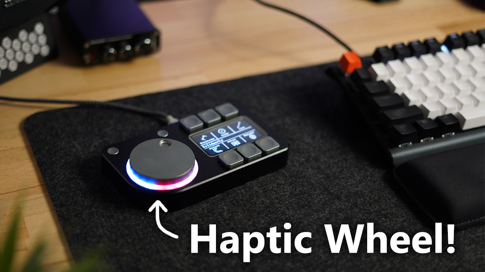
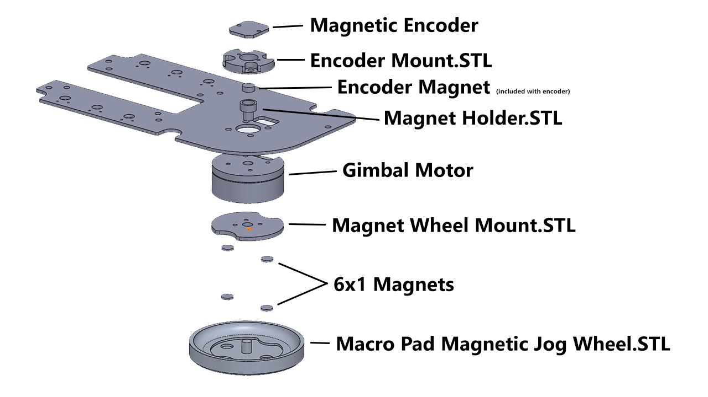

# CNCDan - Haptic Pad


A 6 button macropad with a display for button labels and a mouse knob with haptic feedback!

[Project Video Link](https://youtu.be/bNUKRJQjuvQ)

#### Features

- 6 Programmable  Macro Buttons
- 128x64 OLED display for button labels and Icons
- Support for up to 256 profiles for a total of 1536 Macros!
- Easy XML configuration, no special drivers required!
- Macro button combinations can be configured with up to 3 simultaneous buttons or 3 seperate button presses with configurable delays between them.
- Micro SD Storage for button labels and config files.
- Haptic feedback mouse wheel with three different modes. Clicky, Twist and Momentum
- RGB ring with configurable colours and 5 different display modes. Halo, Bands, Breath, Rainbow, Solid and Off.
- Easy profile switching with up down profile buttons or profile list display.
- The Last profile is stored to the SD card so the macro pad will start on whichever profile was last active.

#### Bill of Materials

1x 128x64 OLED Display - https://www.waveshare.com/2.42inch-oled-module.htm

1x Magnetic Encoder Board - https://www.aliexpress.com/item/1005007469177411.html

1x 2804 100kv Brushless Gimbal Motor - https://www.aliexpress.com/item/1005006008489660.html

6x Kailh Low Profile Switches - https://www.aliexpress.com/item/1005005066585322.html

1x RP2040-Plus Board - https://www.waveshare.com/rp2040-plus.htm

1x TMC6300 Motor Driver Board - https://www.sparkfun.com/sparkfun-brushless-motor-driver-3-phase-tmc6300.html

1x Micro SD Module - https://www.aliexpress.com/item/1005010587984346.html

4x 6x1mm Magnets - https://www.aliexpress.com/item/1005009894772141.html

2x Tactile Buttons - https://www.digikey.com/en/products/detail/panasonic-electronic-components/EVQ-Q2B03W/762882

The following parts are optional if you want to include the LEDS:

20x WS2811 LED's - https://www.aliexpress.com/item/32776731877.html

20x 0.1uF (100nF) 0603 Capacitors - https://www.aliexpress.com/item/32966526545.html

#### Hardware

9x M3x5x5 Threaded Inserts (only needed for printed housing)

3x M3x6 SHCS

2x M3x10 SHCS

10x M2.5x4 SHCS

4x M3x6 CSK

### Printing Instructions

#### - Printed version
Print all files in the 3D Files/STL's folder. You will need 6 of the keycap file, two of the Menu button file and two of the PCB spacer file.


#### - Machined Version
Print all files in the 3D Files/STL's folder except: "Custom Keycap.STL", "Macro Pad - Printed Version.STL" and "Menu Button Printed.STL"
Get all of the .STEP files in the 3D Files/STEP folder machined. Don't include the Macropad Assembly .STEP file from the main directory as it is a complete model of Macro Pad rather than an individual part. If you supply the MacroPad Housing.PDF file with the housing, you can have the mounting holes tapped for you.

### Motor Assembly

I made this quick picture to show how the wheel motor gets assembled:



The "Encoder Mount.STL" part has two small holes in it that are supposed to get tapped to M2 for the encoder. If you don't have an M2 tap, you can probably just glue the encoder to the mount or even use some small self tapping screws to hold it in place.

The magnet holder should be a snug fit inside the hollow motor shaft. If it isn't, I'd recomend a drop of super glue to ensure it can't work free over time.

### PCB's

You will need to have both PCB's made to complete this project. They are very simple PCB's with only two layers, so they should be cheap!
Just upload the Zip files found in "PCB's/MacroPad" and "PCB's/MacroPad Controller Board" to your PCB manufacturer of choice and they shouldn't need any further info.

#### - Controller Board

The controller board has the main components labelled so you should easily be able to tell where everything goes. I've also labelled power and ground connections on the motor controller and SD reader so just double check you are installing them up the correct way! The SD reader should be flat against the PCB as shown in the video, whilst the motor controller gets installed on its pin headers with the "bottom" of the board face up (the side with the pin labels should be showing). The Pico should also be soldered directly to the board with its USB port facing outwards.
C1 on the Controller board is supposed to be a 10000pF 50v Capacitor. I never ended up fitting mine and I've had no issues but Sparkfun recommended it so I've left the pads there in case you decide to fit it.

#### - Main Board

If you're planning to include the LED's, do them first! There should be one corner of the LED with an arrow shaped rebate. It should point away from the pad labelled with a "1". All of the C components on this board are 0.1uF 0603 size capacitors. They are also needed to make the LED's work.

The switches you need for two profile switching buttons are: EVQ-Q2B03W

They share the same footprint as the EVQ-Q2B02W's but are a bit taller so be careful to ensure you get the right ones!

#### - Connecting the boards

All of the pads on both of the PCB's are actually tiny little through holes, I find these are much more robust for beginners which is why I chose them. The hole is too small to put the wire through so just treat them as a surface mount pad!

The controller board has a set of pads labelled "Display". Use the cable that was included with your screen and solder the wires for the display directly to these pads.
I've matched the labels on my PCB to the display so it should be easy to work out where everything goes.

The two boards get connected together with wires. Just match the labels on both boards and everything should be in the correct spot! I know this is messy compared to a ribbon cable, but I was trying to keep the project as beginner friendly as possible!

The three motor wires get connected to the pins labelled U V and W on the controller board. The software should detect the motor direction when it first starts up so any order for these wires is fine but if you have problems, try swapping two of them!

The Encoder connections are labelled too so just connect the four pins I've included on the board and ignore the remainder of the pins that are on the encoder, we don't need them!

### Software

> [!WARNING] 
> The software is still a work in progress. Everything seen in the video is functional currently, but I'm sure I will have missed some bugs as I've only had time to do some limited testing so far. I will work on clearing as many bugs as I can in the coming weeks but let me know if you run into any! If you're going to submit an issue with a bug, please try and recount your steps to re-create the bug as it will make fixing it much easier!

If you don't wish to compile the code yourself, just copy the latest version of the MacroPad.UF2 file from the software folder and install it directly onto the memory of your Pico using the boot method shown in the video.

You will also need to have your SD card set up correctly in order to use the macro pad.
Copy the entire contents of the "Example SD Card" folder onto you SD card to begin with to ensure everything is working before you start working on your own files.

### XML Config

In the `<Settings>` tag of the XML file you will find all of the settings for the LED's, along with the P and I tuning values for the various wheel modes.

There are 6 acceptable inpts for the `<LED_Mode>` tag. If you spell the words incorrectly the commands won't work, so it would be a good idea to copy and paste from here:

Breath, Bands, Halo, Rainbow, Solid, Off

`<LED_Primary>` and `<LED_Secondary>` are the two colours used in the effects and they are formatted in the order of Red, Green and Blue with values between 0-255. Rainbow and Off obviously don't make use of these colour options and solid just sets the colour to `<LED_Primary>` and ignores `<LED_Secondary>`.

The motor tuning for the printed version of the wheel should be pretty good, so try with my default P and I values first before you do any tuning. I've left out D from the tuning options as it doesn't seem to be needed for this type of feedback and just makes tuning more complex.

In the `<Profiles>` tag is where each profile is stored.

Each profile starts off with a name value assigned like this: `<Profile name="Solidworks">`
Then, there is a `<WheelMode>` and `<WheelKey>` tag. `<WheelKey>` can be any key value from this website https://keycode-visualizer.netlify.app/ and will be held down when the wheel is moving. `<WheelMode>` can only be one of three things: Clicky, Twist or Momentum. Again, these have to be exact so copy and paste from here to ensure they work.

Next is a `<MacroButtons>` tag that holds all of our Macro buttons for the profile.

Each macro button looks like this: 
```
<MacroButton>
    <Action>0,68</Action>
    <Action>0,0</Action>
    <Action>0,0</Action>
    <Label>Dimension</Label>
</MacroButton>
```
There will be 6 of these sections per profile. Each action has two values, the first is the delay (in milliseconds) to perform before the action, followed by the keycode you wish to press (using the same website I linked earlier). Setting both of these values to 0 for any of the three actions will mean nothing happens for that action.
Label is simply the name that will appear on screen for that button.

And that's it! just replicate that first example profile as many times as you like (up to 256 times, anyway) and each one will create a new profile that you can store your macros in.
